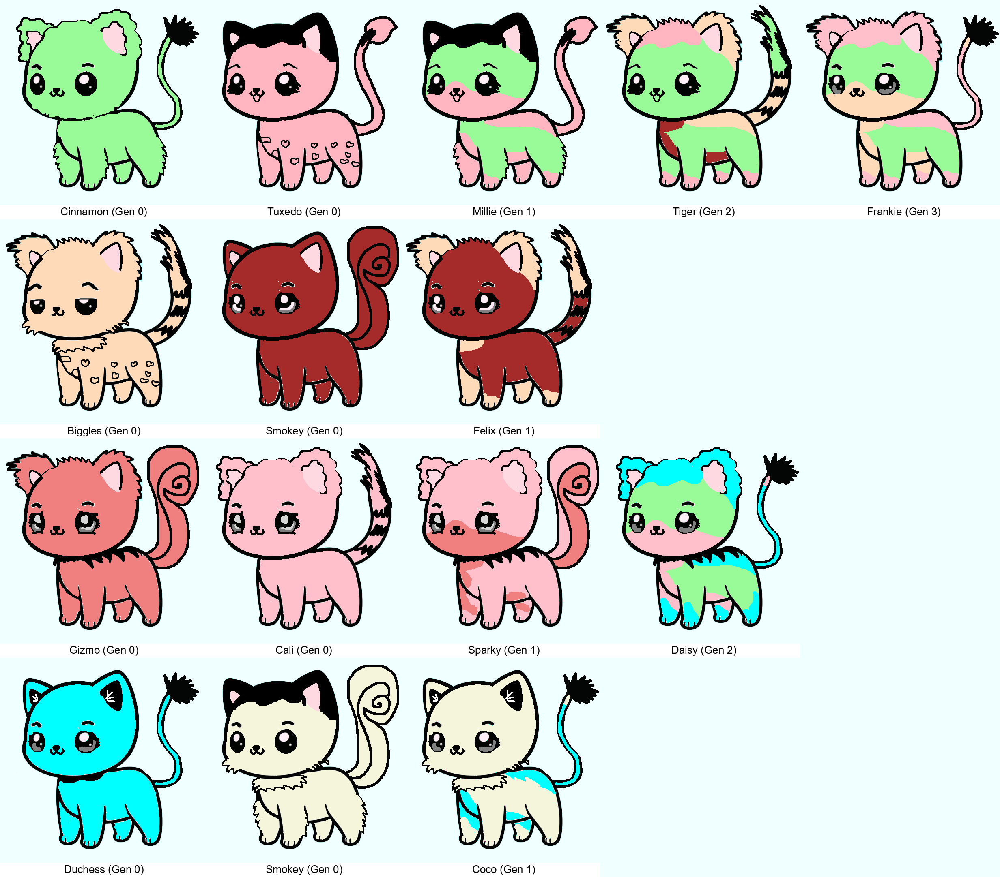

# 🐱 Cat Family Generator

## Example


## 📋 Table of Contents
- [Overview](#-overview)
- [Installation](#-installation)
- [Usage](#-usage)
- [Testing](#-testing)
- [Project Structure](#-project-structure)
- [How It Works](#-how-it-works)
- [Configuration](#-configuration)
- [Examples](#-examples)


## Overview

The Cat Family Generator creates multi-generational cat families by combining randomly selected body parts (ears, eyes, body, tail, legs) and applying genetic color inheritance rules. Each generation inherits traits from its parents, creating unique and colorful cat families!


## How It Works

### 1. **Image Loading**
The `ImageLoader` class validates and loads cat body parts from folders under `parts/`:
- Ears (`parts/ear/`)
- Eyes (`parts/eyes/`)
- Body (`parts/body/`)
- Tail (`parts/tail/`)
- Legs (`parts/legs/`)

You can draw and add more PNG variants into any of these folders — they will be picked up automatically.

### 2. **Part Combination**
`CatImageBuilder` arranges parts vertically:
```
┌─────────┐
│  Ears   │
├─────────┤
│  Eyes   │
├─────────┼───────┐
│  Body   │ Tail  │
├─────────┴───────┤
│      Legs       │
└─────────────────┘
```

### 3. **Color Application**
Original images use grayscale templates. Colors are applied by:
1. Detecting gray shades in the template
2. Mapping each shade to a genetic color
3. Using NumPy for efficient pixel replacement

### 4. **Genetic Inheritance**

#### **Generation 0: Parents**
- Single solid color
- Random body parts

#### **Generation 1: Kittens**
- Inherit body parts randomly from each parent (50/50 chance)
- Each gray shade gets a random parent color

#### **Generation 2: Grandkittens**
- Inherit parts from kitten parents
- Combine color pools from both parents
- Select 2-3 colors for variation
- Main body gets a specific color from ancestors

#### **Generation 3: Great-Grandkitten**
- Same inheritance rules as Generation 2
- Built from the two grandkittens

### 5. **Family Layout**
The final image is a left-to-right pedigree: generations are columns, children sit vertically between their parents, and bracket lines connect each pair to their child.

`
Gen 0          Gen 1         Gen 2          Gen 3
────────       ──────        ──────         ──────
Parent1 ──┐
          ├── Kitten1 ──┐
Parent2 ──┘             │
                        ├── GrandKitten1 ──┐
Parent3 ──┐             │                  │
          ├── Kitten2 ──┘                  │
Parent4 ──┘                                ├── GreatGrandKitten
Parent5 ──┐                                │
          ├── Kitten3 ──┐                  │
Parent6 ──┘             │                  │
                        ├── GrandKitten2 ──┘
Parent7 ──┐             │
          ├── Kitten4 ──┘
Parent8 ──┘
`


## ⚙️ Configuration

### Color Palette (`cats_colors.py`)

Cat colors live in a separate file: `cats_colors.py`. You can extend the list with any colors you like. Use RGB tuples in the form `(R, G, B)` with values from 0 to 255. The built-in palette is mostly soft pastel shades, but you can add brighter or darker colors as well.

```python
CATS_COLORS = [
    (255, 193, 204),  # example pastel pink
    (255, 0, 0),      # add your own RGB colors
    (0, 255, 0),
    # ...
]
```

### Cat Names (`cats_name.TXT`)

Cat names are taken from `cats_name.TXT`. Put any names you like there — one name per line. They will be used when labeling cats in the family image.

### Other settings (`config.py`)

Edit `config.py` for paths, fonts, layout, and output options.

### Command-Line Options

| Option | Description | Default |
|--------|-------------|---------|
| `-o`, `--output` | Output filename | `cats_family.png` |
| `--seed` | Random seed for reproducibility | Random |
| `-v`, `--verbose` | Enable debug logging | Off |
| `--log` | Save logs to file | None |
| `-h`, `--help` | Show help message | - |

## Project Structure

```
Generate_cats_family_png/
├── main.py                 # Main entry point with CLI
├── cat.py                  # Cat classes and genetics logic
├── image_processing.py     # Image manipulation and combining
├── config.py               # Paths and generation parameters
├── cats_colors.py          # Cat color palette (edit to add colors)
├── requirements.txt        # Python dependencies
├── README.md               # This file
├── .gitignore              # Git ignore patterns
├── cats_name.TXT           # List of cat names
├── cats_family.png         # Example output
├── base.png                # Base cat template
├── parts/                  # Cat body part images
│   ├── body/               # Body variants (PNG)
│   ├── ear/                # Ear variants (PNG)
│   ├── eyes/               # Eye variants (PNG)
│   ├── legs/               # Leg variants (PNG)
│   └── tail/               # Tail variants (PNG)
└── tests/                  # Project tests
```

### Custom body parts

Want more variety? Draw your own parts and drop PNG files into the matching folder under `parts/` (for example `parts/ear/8.png`). Use the same grayscale style as the existing assets so coloring still works. New files are included automatically — no code changes needed.
## Installation

### Prerequisites

- Python 3.8 or higher
- pip (Python package manager)

### Steps

1. **Clone the repository**
   ```bash
   git clone https://github.com/rin8351/Generate_cats_family_png.git
   cd Generate_cats_family_png
   ```

2. **Install dependencies**
   ```bash
   pip install -r requirements.txt
   ```

3. **Verify installation**
   ```bash
   python main.py --help
   ```

## Testing

Tests live in `tests/` and are run with [pytest](https://pytest.org/) (configured in `pytest.ini`). They are not called from the generator itself — run them separately:

```bash
pytest
```

Or explicitly:

```bash
pytest tests/ -v
```

On every push and pull request to `main`/`master`, GitHub Actions runs the same suite (see `.github/workflows/tests.yml`).

## Usage

### Basic Usage

Generate a cat family with default settings:

```bash
python main.py
```

This creates `cats_family.png` in the current directory.

### Advanced Usage

**Custom output filename:**
```bash
python main.py -o my_awesome_cats.png
```

**Reproducible generation with seed:**
```bash
python main.py --seed 42
```

**Verbose logging:**
```bash
python main.py -v
```

**Save logs to file:**
```bash
python main.py --log generation.log
```

**All options combined:**
```bash
python main.py -o output/family.png --seed 123 -v --log cats.log
```


### Generation Parameters
```python
GENERATION_PARAMS = {
    'background_color': (240, 255, 255),  # Background color
    'font_name': 'arial.ttf',             # Font for cat names
    'font_size': 22,                      # Font size (name + parents line)
    'text_color': (0, 0, 0),              # Text color (black)
    'text_position': (0, 5),              # Text offset (x: from center, y: from bottom)
    'text_padding_bottom': 60,            # Extra space at bottom for multiline text
    'column_gap': 48,                     # Gap between pedigree columns (for lines)
    'connector_color': (80, 80, 80),      # Pedigree link color
    'connector_width': 2,                 # Pedigree link thickness
}
```

**Text Position Parameters:**
- `text_position`: `(x, y)` offset for fine-tuning text placement
  - `x`: horizontal offset from center (positive = right, negative = left)
  - `y`: vertical offset from bottom (higher value = more space from bottom)
- `text_padding_bottom`: extra white space below each cat for name / parents labels

### Output Settings
```python
OUTPUT_SETTINGS = {
    'default_filename': 'cats_family.png',
    'format': 'PNG',
    'quality': 95,
}
```

## 📸 Examples

### Example 1: Default Generation
```bash
python main.py
```
Generates a random cat family with varied colors and patterns.

### Example 2: Reproducible Output
```bash
python main.py --seed 42 -o reproducible_cats.png
```
Creates the same cat family every time (useful for testing).

### Example 3: Debug Mode
```bash
python main.py -v --log debug.log
```
Generates cats while logging detailed information for troubleshooting.

