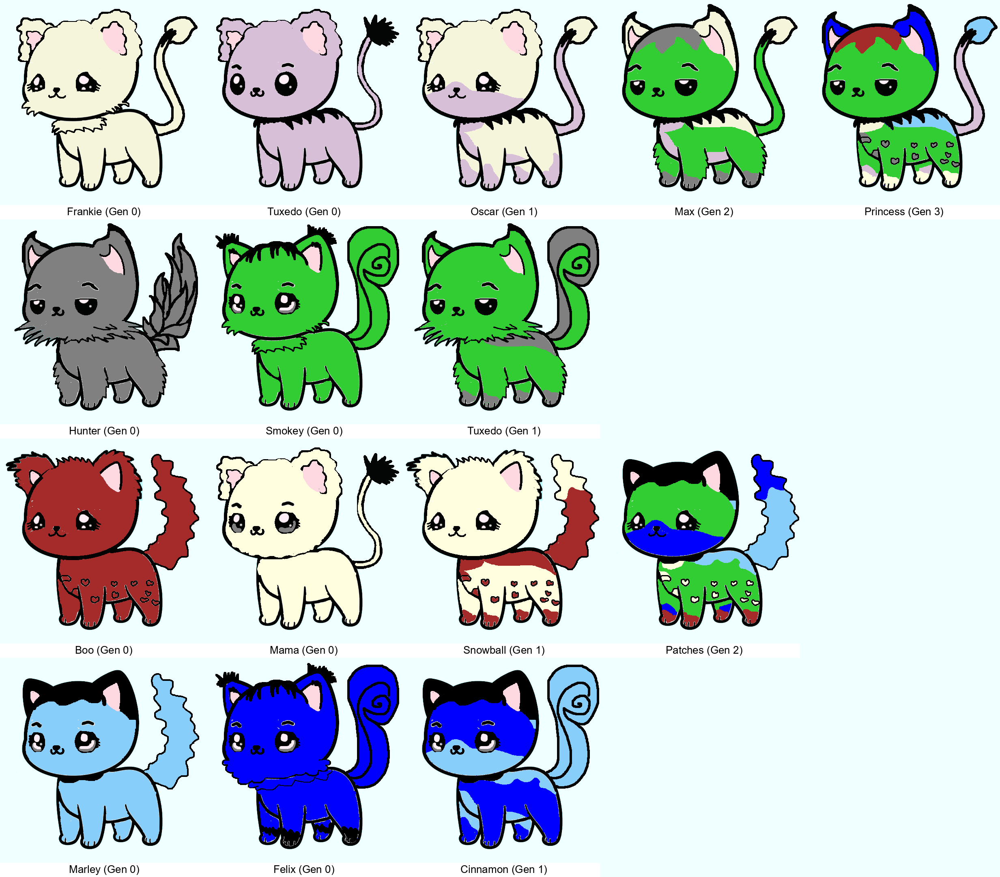

# 🐱 Cat Family Generator

## 📋 Table of Contents



- [Overview](#-overview)
- [Installation](#-installation)
- [Usage](#-usage)
- [Project Structure](#-project-structure)
- [How It Works](#-how-it-works)
- [Configuration](#-configuration)
- [Examples](#-examples)

## 🎯 Overview

The Cat Family Generator creates multi-generational cat families by combining randomly selected body parts (ears, eyes, body, tail, legs) and applying genetic color inheritance rules. Each generation inherits traits from its parents, creating unique and colorful cat families!


## 🚀 Installation

### Prerequisites

- Python 3.8 or higher
- pip (Python package manager)

### Steps

1. **Clone the repository**
   ```bash
   git clone https://github.com/yourusername/cat-family-generator.git
   cd cat-family-generator
   ```

2. **Install dependencies**
   ```bash
   pip install -r requirements.txt
   ```

3. **Verify installation**
   ```bash
   python main.py --help
   ```

## 💻 Usage

### Basic Usage

Generate a cat family with default settings:

```bash
python main.py
```

This creates `cats_family.png` in the current directory.

### Advanced Usage

**Custom output filename:**
```bash
python main.py -o my_awesome_cats.png
```

**Reproducible generation with seed:**
```bash
python main.py --seed 42
```

**Verbose logging:**
```bash
python main.py -v
```

**Save logs to file:**
```bash
python main.py --log generation.log
```

**All options combined:**
```bash
python main.py -o output/family.png --seed 123 -v --log cats.log
```

### Command-Line Options

| Option | Description | Default |
|--------|-------------|---------|
| `-o`, `--output` | Output filename | `cats_family.png` |
| `--seed` | Random seed for reproducibility | Random |
| `-v`, `--verbose` | Enable debug logging | Off |
| `--log` | Save logs to file | None |
| `--pairs` | Number of parent pairs | 2 |
| `-h`, `--help` | Show help message | - |

## 📁 Project Structure

```
cat-family-generator/
├── main.py                 # Main entry point with CLI
├── cat.py                  # Cat classes and genetics logic
├── image_processing.py     # Image manipulation and combining
├── config.py              # Configuration and constants
├── requirements.txt       # Python dependencies
├── README.md             # This file
├── .gitignore           # Git ignore patterns
├── cats_name.TXT        # List of cat names
├── base.png             # Base cat template
├── body/                # Body part images (1-7.png)
├── ear/                 # Ear images (1-7.png)
├── eyes/                # Eye images (1-8.png)
├── legs/                # Leg images (1-7.png)
└── tail/                # Tail images (1-8.png)
```

## 🔬 How It Works

### 1. **Image Loading**
The `ImageLoader` class validates and loads cat body parts from folders:
- Ears (7 variants)
- Eyes (8 variants)
- Body (7 variants)
- Tail (8 variants)
- Legs (7 variants)

### 2. **Part Combination**
`CatImageBuilder` arranges parts vertically:
```
┌─────────┐
│  Ears   │
├─────────┤
│  Eyes   │
├─────────┼───────┐
│  Body   │ Tail  │
├─────────┴───────┤
│      Legs       │
└─────────────────┘
```

### 3. **Color Application**
Original images use grayscale templates. Colors are applied by:
1. Detecting gray shades in the template
2. Mapping each shade to a genetic color
3. Using NumPy for efficient pixel replacement

### 4. **Genetic Inheritance**

#### **Generation 0: Parents**
- Single solid color
- Random body parts

#### **Generation 1: Kittens**
- Inherit body parts randomly from each parent (50/50 chance)
- Each gray shade gets a random parent color

#### **Generation 2: Grandkittens**
- Inherit parts from kitten parents
- Combine color pools from both parents
- Select 2-3 colors for variation
- Main body gets a specific color from ancestors

#### **Generation 3: Great-Grandkittens**
- Ultimate genetic combination
- Multi-colored with complex patterns

### 5. **Family Layout**
The final image arranges cats in a family tree pattern:

```
Row 1: Parent1  Parent2  Kitten1  GrandKitten1  GreatGrandKitten
Row 2: Parent3  Parent4  Kitten2
Row 3: Parent5  Parent6  Kitten3  GrandKitten2
Row 4: Parent7  Parent8  Kitten4
```

### 6. **Family Tree Structure**

The cat family follows this genealogical pattern across 4 generations:

```
Generation 0 (Parents):
  ┌─────────┐   ┌─────────┐
  │ Parent1 │ ♥ │ Parent2 │
  └────┬────┘   └────┬────┘
       └────────┬────┘
                │
Generation 1 (Kittens):      ┌─────────┐
                    ┌────────┤ Kitten1 ├────────┐
                    │        └─────────┘        │
                    │                           │
  ┌─────────┐   ┌──┴──────┐                    │
  │ Parent3 │ ♥ │ Parent4 │                    │
  └────┬────┘   └────┬────┘                    │
       └────────┬────┘                          │
                │                               │
                │        ┌─────────┐            │
                └────────┤ Kitten2 ├────────┐   │
                         └─────────┘        │   │
                                            │   │
Generation 2 (Grandkittens):                │   │
                         ┌──────────────────┴───┴───┐
                         │         GrandKitten1      │
                         └────────────┬──────────────┘
                                      │
  ┌─────────┐   ┌─────────┐           │
  │ Parent5 │ ♥ │ Parent6 │           │
  └────┬────┘   └────┬────┘           │
       └────────┬────┘                │
                │                     │
                │        ┌─────────┐  │
                └────────┤ Kitten3 ├──┤
                         └─────────┘  │
                                      │
  ┌─────────┐   ┌─────────┐           │
  │ Parent7 │ ♥ │ Parent8 │           │
  └────┬────┘   └────┬────┘           │
       └────────┬────┘                │
                │                     │
                │        ┌─────────┐  │
                └────────┤ Kitten4 ├──┤
                         └─────────┘  │
                                      │
                         ┌────────────┴──────────────┐
                         │      GrandKitten2         │
                         └────────────┬──────────────┘
                                      │
Generation 3 (Great-Grandkitten):     │
                         ┌────────────┴──────────────┐
                         │   GreatGrandKitten        │
                         └───────────────────────────┘
```

**Family Relationships:**
- **Generation 0**: 8 parents (4 pairs)
  - Parent1 ♥ Parent2 → Kitten1
  - Parent3 ♥ Parent4 → Kitten2
  - Parent5 ♥ Parent6 → Kitten3
  - Parent7 ♥ Parent8 → Kitten4

- **Generation 1**: 4 kittens (forming 2 pairs)
  - Kitten1 ♥ Kitten2 → GrandKitten1
  - Kitten3 ♥ Kitten4 → GrandKitten2

- **Generation 2**: 2 grandkittens (forming 1 pair)
  - GrandKitten1 ♥ GrandKitten2 → GreatGrandKitten

- **Generation 3**: 1 great-grandkitten (final descendant)

Each cat's name is displayed with its generation label (e.g., "Lucky (Gen 0)") to make family relationships clear.

## ⚙️ Configuration

Edit `config.py` to customize:

### Color Palette
```python
CATS_COLORS = [
    (255, 0, 0),    # Add your RGB colors
    (0, 255, 0),
    # ...
]
```

### Generation Parameters
```python
GENERATION_PARAMS = {
    'background_color': (240, 255, 255),  # Background color
    'font_name': 'arial.ttf',             # Font for cat names
    'font_size': 26,                      # Font size (for names with Gen info)
    'text_color': (0, 0, 0),              # Text color (black)
    'text_position': (10, 5),             # Text offset (x: horizontal, y: vertical)
    'text_padding_bottom': 35,            # Extra space at bottom for text
}
```

**Text Position Parameters:**
- `text_position`: `(x, y)` offset for fine-tuning text placement
  - `x`: horizontal offset from center (positive = right, negative = left)
  - `y`: vertical offset from bottom (higher value = more space from bottom)
- `text_padding_bottom`: extra white space added below each cat for the name label

### Output Settings
```python
OUTPUT_SETTINGS = {
    'default_filename': 'cats_family.png',
    'format': 'PNG',
    'quality': 95,
}
```

## 📸 Examples

### Example 1: Default Generation
```bash
python main.py
```
Generates a random cat family with varied colors and patterns.

### Example 2: Reproducible Output
```bash
python main.py --seed 42 -o reproducible_cats.png
```
Creates the same cat family every time (useful for testing).

### Example 3: Debug Mode
```bash
python main.py -v --log debug.log
```
Generates cats while logging detailed information for troubleshooting.

